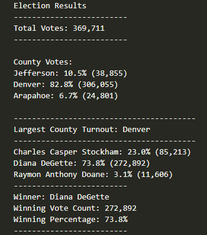

# Election_Analysis
Purpose: Help Tom- the election audit to report the total number of votes case, the total vote of each candidate and the percentage vote of each candidate in order to choose the winner of the election based on the popular vote.
# Election Audit results:
![Total Votes](Resources/total_votes.png
1. The total number of the votes in this congressional election: 369,711 votes 

2. The number of votes and the percentage of total votes for each county in the precinct:
    + Jefferson: got 38,855 votes which is 10.5%
    + Denver: got 306,055 votes which is 82.8%
    + Arapahoe: got 24,801 votes which is 6.7%

3. County had the largest number of votes: Denver

4.The number of votes and the percentage of the total votes each candidate received.
    + Charles Casper Stockham got 85,213 votes which is 23%
    + Diana DeGette got 272,892 votes which is 73.8%
    + Raymon Anthony Doane got 11,606 votes which is 3.1%

5. Which candidate won the election, what was their vote count, and what was their percentage of the total votes?
    + Diana DeGette is the winner of this election with total 272,892 votes and 73.8% of total votes. 

# Summary

This script can be used for any election in order to get the results quickly. Python can import the cvs find to help the audit to convert list of voter into the dictionary, or find the maximum and get the count value to find the winner. 

